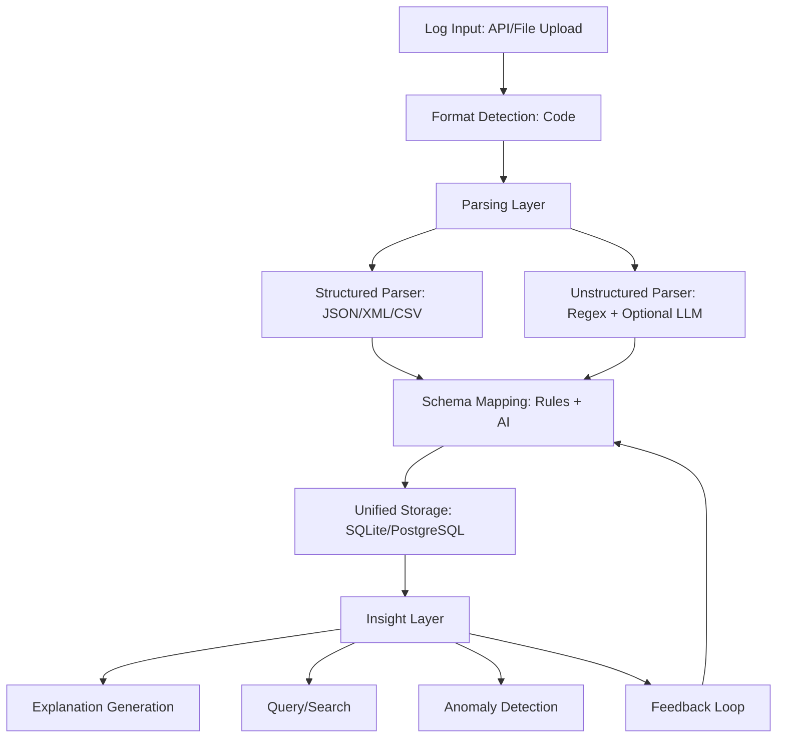

# Architecture Diagram

```mermaid
flowchart TD
    A[Log Input: API/File Upload] --> B[Format Detection: Code]
    B --> C[Parsing Layer]
    C --> C1[Structured Parser: JSON/XML/CSV]
    C --> C2[Unstructured Parser: Regex + Optional LLM]
    C1 --> D[Schema Mapping: Rules + AI]
    C2 --> D
    D --> E[Unified Storage: SQLite/PostgreSQL]
    E --> F[Insight Layer]
    F --> F1[Explanation Generation]
    F --> F2[Query/Search]
    F --> F3[Anomaly Detection]
    F --> G[Feedback Loop]
    G --> D
```

## Pipeline Type
Data processing pipeline (not CI/CD):
`HTTP Input -> Parse -> Normalize -> Store -> Analyze -> Output`
